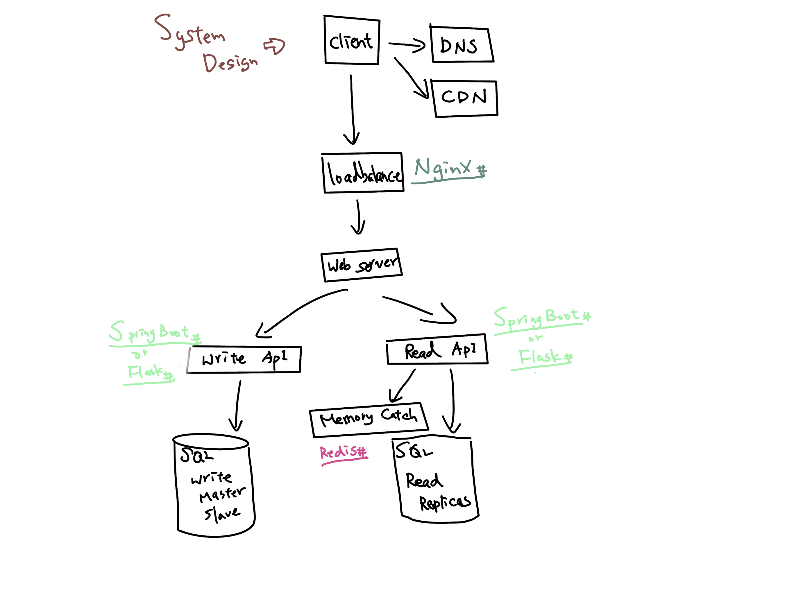

# **Simple Project**

###### Fast Learning Flask
###### Build With My Proficiency in Web Backend

Use technology:
```
- python
- Flask
- Redis
- MySQL
```

Next Step:
```
- Data Sharding (Horizontal Scaling)
```

System Design:


## API
User:
| Method   | URL                                      | Description                              |
| -------- | ---------------------------------------- | ---------------------------------------- |
| `POST`   | `/users/SignIn`                          | User SignIn.                             |
| `POST`   | `/users/SignUp`                          | User SignUp.                             |
| `PUT`    | `/users/{user_Id}`                       | Update data in users #userId.            |

Product:
| Method   | URL                                      | Description                              |
| -------- | ---------------------------------------- | ---------------------------------------- |
| `GET`    | `/products`                              | Retrieve all products.                   |
| `GET`    | `/product/{product_Id}`                  | Retrieve products #product_Id.           |
| `PUT`    | `/product/{product_Id}`                  | Update data in products #product_Id.     |

Add to car:
| Method   | URL                                      | Description                              |
| -------- | ---------------------------------------- | ---------------------------------------- |
| `GET`    | `/addToCars/{user_Id}`                   | Retrieve users cars #user_Id.            |
| `POST`   | `/addToCars/{user_Id}`                   | Create a new users cars #user_Id.        |
| `GET`    | `/addToCar/{addToCar_Id}`                | Retrieve cars #addToCar_Id.              |
| `PUT`    | `/addToCar/{addToCar_Id}`                | Update data in cars #addToCar_Id.        |

Tweets:
| Method   | URL                                      | Description                              |
| -------- | ---------------------------------------- | ---------------------------------------- |
| `GET`    | `/tweets?limit=10&page=4`                | Retrieve page 4 of the tweets with 10 tweets per page.|
| `GET`    | `/tweets/{user_Id}?limit=10&page=4`      | Retrieve page 4 of the tweets for #user_Id with 10 tweets per page.|
| `POST`   | `/tweets/{user_Id}`                      | Create a new tweets #user_Id.            |
| `GET`    | `/tweet/{tweet_Id}`                      | Retrieve tweets #tweet_Id.               |
| `PUT`    | `/tweet/{tweet_Id}`                      | Update data in tweets #tweet_Id.         |

Follow:
| Method   | URL                                      | Description                              |
| -------- | ---------------------------------------- | ---------------------------------------- |
| `GET`    | `/followers/{user_Id}`                   | Retrieve users following #user_Id.       |
| `POST`   | `/followers/{user_Id}`                   | Create a new users following #user_Id.   |
| `DELETE` | `/followers/{user_Id}`                   | Delete users following #user_Id.         |

## HTTP Response Status Codes

| Code  | Title                     | Description                              |
| ----- | ------------------------- | ---------------------------------------- |
| `200` | `OK`                      | When a request was successfully processed (e.g. when using `GET`, `PATCH`, `PUT` or `DELETE`). |
| `201` | `Created`                 | Every time a record has been added to the database (e.g. when creating a new user or post). |
| `304` | `Not modified`            | When returning a cached response. |
| `400` | `Bad request`             | When the request could not be understood (e.g. invalid syntax). |
| `401` | `Unauthorized`            | When authentication failed. |
| `403` | `Forbidden`               | When an authenticated user is trying to perform an action, which he/she does not have permission to. |
| `404` | `Not found`               | When URL or entity is not found. |
| `440` | `No accept header`        | When the required "Accept" header is missing from the request. |
| `422` | `Unprocessable entity`    | Whenever there is something wrong with the request (e.g. missing parameters, validation errors) even though the syntax is correct (ie. `400` is not warranted). |
| `500` | `Internal server error`   | When an internal error has happened (e.g. when trying to add/update records in the database fails). |
| `502` | `Bad Gateway`             | When a necessary third party service is down. |